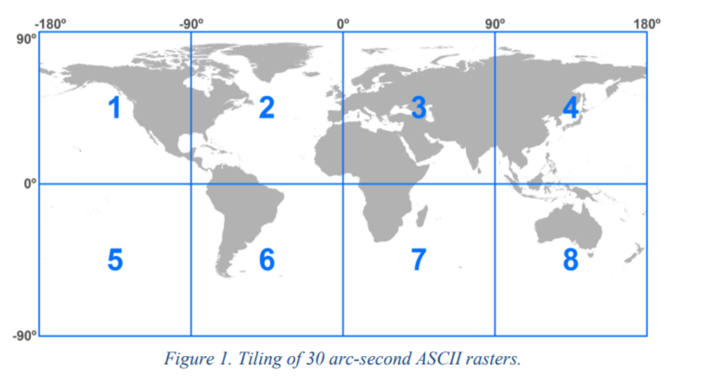
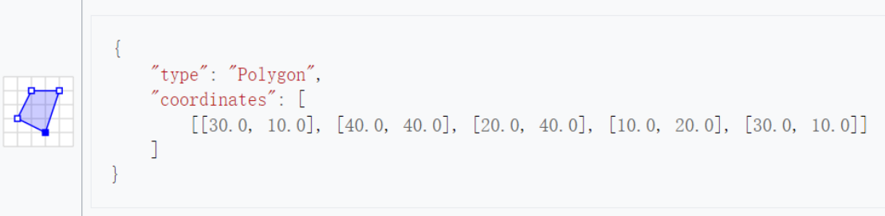
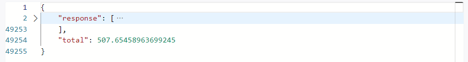
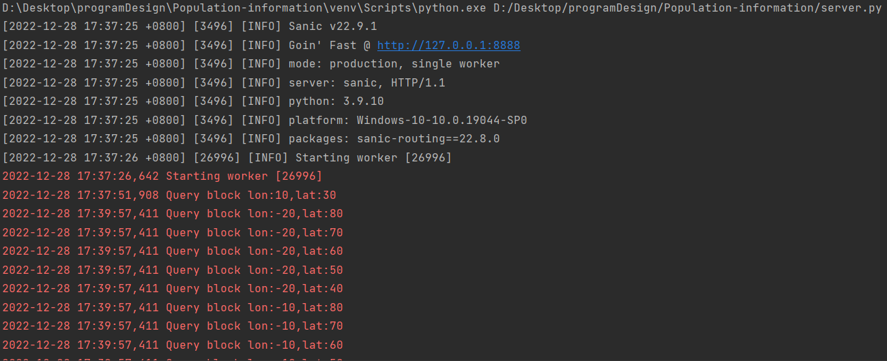
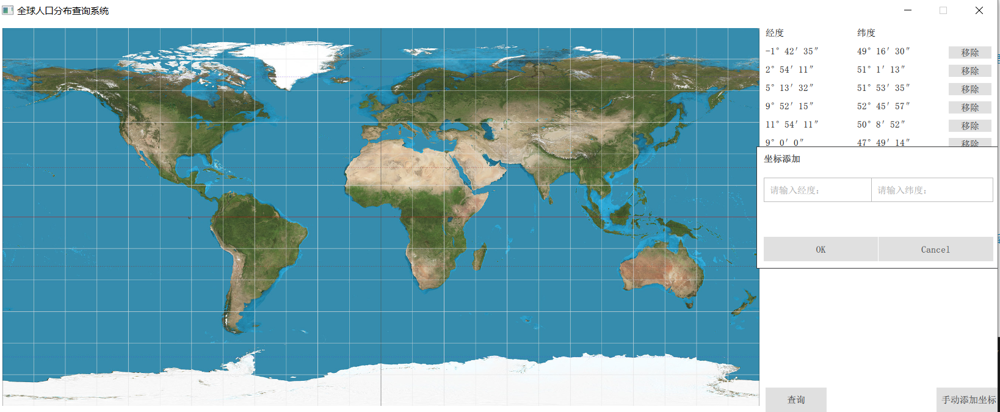
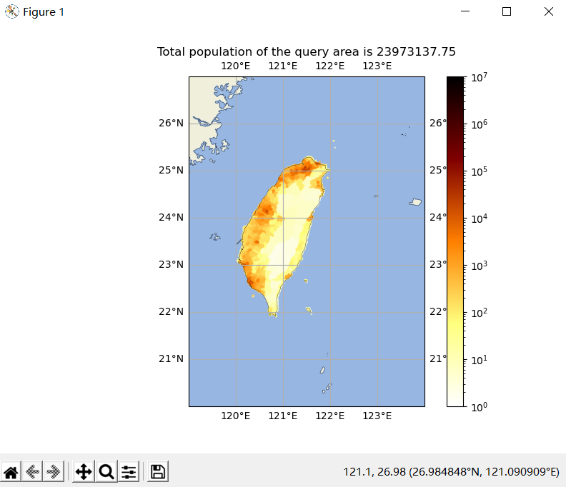
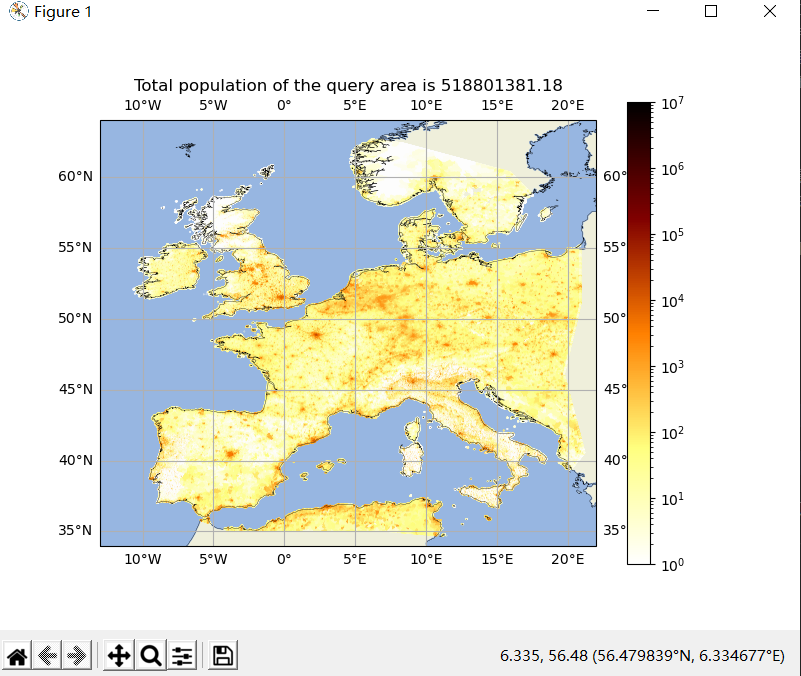
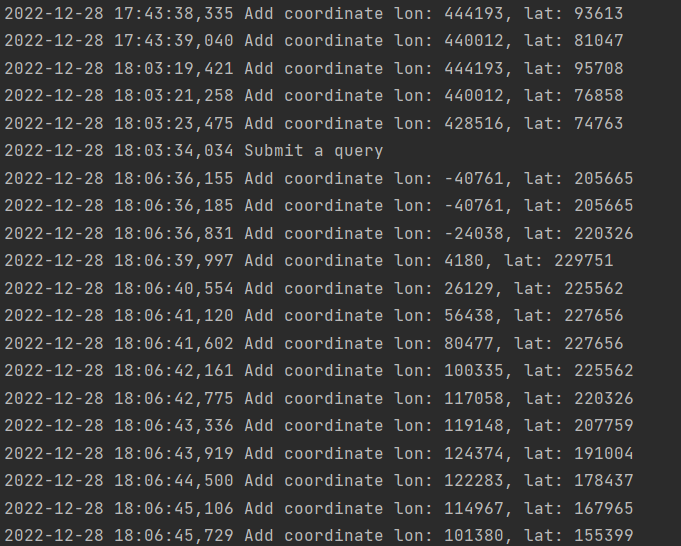

# Python程序设计-大作业

班级：2020211307

学号：2020211472

姓名：林志

## 作业题目

### 数据

gpw-v4-population-count-rev11_2020_30_sec_asc.zip是一个全球人口分布数据压缩文件，解压后包括了8个主要的asc后缀文件，他们是全球网格化的人口分布数据文件，这些文件分别是：

* gpw-v4-population-count-rev11_2020_30_sec_1.asc
* gpw-v4-population-count-rev11_2020_30_sec_2.asc
* gpw-v4-population-count-rev11_2020_30_sec_3.asc
* gpw-v4-population-count-rev11_2020_30_sec_4.asc
* gpw-v4-population-count-rev11_2020_30_sec_5.asc
* gpw-v4-population-count-rev11_2020_30_sec_6.asc
* gpw-v4-population-count-rev11_2020_30_sec_7.asc
* gpw-v4-population-count-rev11_2020_30_sec_8.asc 

这些文件分布对应地球不同经纬度的范围。



压缩文件下载网页：https://sedac.ciesin.columbia.edu/data/set/gpw-v4-population-count-rev11/data-download

### 服务端

压缩文件（gpw-v4-population-count-rev11_2020_30_sec_asc.zip）是一个全球人口分布数据。基于Sanic实现一个查询服务，服务包括：

* 按给定的经纬度范围查询人口总数，查询结果采用JSON格式。
* 不可以采用数据库，只允许使用文件方式存储数据。
* 可以对现有数据进行整理以便加快查询速度，尽量提高查询速度。

查询参数格式 采用GeoJSON（https://geojson.org/）的多边形（每次只需要查询一个多边形范围，只需要支持凸多边形）



### 客户端

针对上面的查询服务，实现一个服务查询客户端，数据获取后使用Matplotlib散点图（Scatter）进行绘制。

* 横坐标（x轴）为经度。
* 纵坐标（y轴）为维度。

## 服务端代码

程序源代码嵌入下方的code block中。

```python
"""
 * @file server.py
 * @author LinZhi 2020211472
 * @brief
        人口数据查询系统服务端模块
        基于Sanic实现
 * @version 0.1
 * @date 2022-12-23
 * @copyright Copyright (c) 2022
"""

import asyncio
import math
import os
import logging
import numpy as np
from sanic import Sanic, json
from shapely import geometry
from shapely.errors import TopologicalError

app = Sanic("Population_Count")


@app.listener("before_server_start")
async def init_server(loop):
    step = 10  # 将所有的块划分为10°*10°的小块进行处理，原大小为90°*90°
    start = 0
    stop = 90
    factor = 120
    for i in range(1, 9):
        with open(
            f"./gpw-v4-population-count-rev11_2020_30_sec_asc/gpw_v4_population_count_rev11_2020_30_sec_{i}.asc"
        ) as f:
            f.readline()
            f.readline()
            #   记录经度
            lon = int(float(f.readline().split()[1]))
            #   记录纬度
            lat = int(float(f.readline().split()[1])) + 90
            #   检查一个文件中所有块是否预处理完毕
            finished = True
            for lon_offset in range(start, stop, step):
                for lat_offset in range(start, stop, step):
                    if not os.path.exists(
                        f"./data/lon_{lon + lon_offset}_lat_{lat - lat_offset}.npy"
                    ):
                        finished = False
                        break
                if not finished:
                    break
            if finished:
                continue
            data = np.genfromtxt(
                f"./gpw-v4-population-count-rev11_2020_30_sec_asc/gpw_v4_population_count_rev11_2020_30_sec_{i}.asc",
                skip_header=6,
            )
            data[data == -9999] = np.nan  # 无效数据处理
            for lon_offset in range(start, stop, step):
                for lat_offset in range(start, stop, step):
                    if not os.path.exists(
                        f"./data/lon_{lon + lon_offset}_lat_{lat - lat_offset}.npy"
                    ):
                        np.save(
                            f"./data/lon_{lon + lon_offset}_lat_{lat - lat_offset}.npy",
                            data[
                                lat_offset * factor : (lat_offset + step) * factor,
                                lon_offset * factor : (lon_offset + step) * factor,
                            ],
                        )


@app.post("/Query")
async def Query(request):
    """

    :param request: 参数 GeoJson格式，多边形参数以角秒为单位传递
    :return: json json格式，包括各点的坐标与人口，总人口
    """
    try:
        param = request.json.get("coordinates")
        polygon = geometry.Polygon(param)
        lon_min, lat_min, lon_max, lat_max = polygon.bounds
        step = 10
        factor = 60 * 60
        unit = 30
        response = []
        total = 0
        tasks = []
        # 计算分块信息
        lon_min = math.floor(lon_min / factor / step) * step
        lat_min = math.floor(lat_min / factor / step) * step
        lon_max = math.ceil(lon_max / factor / step) * step
        lat_max = math.ceil(lat_max / factor / step) * step
        #   找到块
        for i in range(lon_min, lon_max, step):
            for j in range(lat_max, lat_min, -step):
                logging.info(f"Query block lon:{i},lat:{j}")
                tasks.append(
                    asyncio.create_task(get_message(i, j, polygon, step, factor, unit))
                )
        for task in tasks:
            first, second = await task
            response += first
            total += second
        return json({"response": response, "total": total})
    except KeyError:
        return json({}, status=400)
    except (ValueError, TopologicalError):
        return json({}, status=406)


async def get_message(lon, lat, polygon, step, factor, unit):
    """
    :param unit: 基本操作单元
    :param lon: 经度
    :param lat: 纬度
    :param polygon: 多边形参数
    :param step: 经纬度块间距
    :param factor: 放缩因子 格-角秒
    :return: 坐标序列与人数
    """
    #   此时是角秒单位，而块单元以30角秒为单位
    lon_min, lat_min, lon_max, lat_max = polygon.bounds
    data = np.load(f"./data/lon_{lon}_lat_{lat}.npy")
    response = []
    total = 0
    lon_min = max(math.floor(lon_min / unit) * unit, lon * factor)
    lat_min = max(math.floor(lat_min / unit) * unit, (lat - step) * factor)
    lon_max = min(math.ceil(lon_max / unit) * unit, (lon + step) * factor)
    lat_max = min(math.ceil(lat_max / unit) * unit, lat * factor)
    for i in range(lon_min, lon_max, unit):
        for j in range(lat_max, lat_min, -unit):
            cell_polygon = geometry.Polygon(
                ((i, j), (i + unit, j), (i + unit, j - unit), (i, j - unit))
            ).intersection(
                polygon
            )  # 该cell和多边形的重合部分
            if cell_polygon.area > 0:  # 如果有重合
                x = int((lat * factor - j) / unit)
                y = int((i - lon * factor) / unit)
                response.append((i, j, cell_polygon.area / (unit * unit) * data[x, y]))
                if not np.isnan(response[-1][2]):
                    total += response[-1][2]
    return response, total


if __name__ == "__main__":
    app.run(host="127.0.0.1", port=8888)

```

### 代码说明
    服务端采用python语言编写，基于Sanic框架实现

####    数据预处理
        源数据中，每个文件保存的是90°*90°地理范围内的人口数据，以ASCII码形式保存，文件较大，每次读取与遍历的时间
    开销较大。因此，我在预处理中，将文件重新划分成10°*10°地理范围内的人口数据，以二进制文件形式保存。同时，将源数
    据中 -9999的值记录为无效数据NaN。另外，因为针对每个文件的重新划分需要较大的时间开销，故在预处理操作时，会先检
    查每个文件是否被全部处理过，如若没有，才读取该文件进行重新划分。在划分操作过程中，也会检查对应划分子文件是否已经
    存在，若已经存在，则不再重新生成对应子文件，从而减少时间开销。

####    请求处理
        查询参数格式采用GeoJSON格式的凸多边形数据，单位为角秒。查询结果采用Json格式。若参数格式有误或服务器内部
    出现异常，服务器讲返回非200的状态码提醒客户端。若请求能够正常处理，服务器将返回状态码200以及查询结果数据。同时
    为了直观地看到服务端的处理结果，我使用了APIFOX模拟前端进行请求，可看到服务端返回的结果如下


####    数据查询
        服务端接受到客户端发送来的查询请求后，利用shapely库的内置方法，根据查询参数创建多边形，并求出经纬度的边界
    值。根据获得的经纬度边界值确定需要查询的人口数据块（即数据预处理中获得到的的各个10°*10°地理坐标块）。对于每个
    包含多边形的块，遍历该块中与多边形重合的经纬度，以30“*30”为⼀个单元（因为这是数据记录的基本单元），对于其中每
    个数据单元，计算它和多边形重合的⾯积，如果⾯积⼤于0，则将重合的⾯积⽐整个数据单元⾯积的权重乘这个数据单元中的⼈
    数（即实际在多边形中的⼈数）加⼊答案当中。在此过程中，还需要对无效数据进行判断。

####    性能优化
        服务端程序主要从两方面进行优化。
    1.预处理模块，针对已处理过的数据不再进行重复处理，减少文件读写次数
    2.查询模块，对于跨越多块的多边形区域，各个块进行并行查询，缩短查询时间
####    日志记录
        为方便查看每次处理请求时，服务端所查询的数据块是否正确，我利用python自带的logging库进行日志记录，效果如下：


## 客户端代码

客户端代码嵌入下发的code block中。

```python
"""
 * @file client.py
 * @author LinZhi 2020211472
 * @brief
        人口数据查询系统客户端模块
        基于python、QT、QML实现
 * @version 0.1
 * @date 2022-12-23
 * @copyright Copyright (c) 2022
"""
import math
import sys
import requests
import logging
import numpy as np
import matplotlib as mpl
import matplotlib.pyplot as plt
from cartopy import crs, feature
from PyQt5.QtCore import QObject, pyqtProperty, pyqtSlot, pyqtSignal
from PyQt5.QtWidgets import QApplication
from PyQt5.QtQml import QQmlApplicationEngine, QQmlListProperty

class Coordinate(QObject):
    def __init__(self, x: int, y: int, parent=None):
        super().__init__(parent)
        self.x = x
        self.y = y

    def __str__(self):
        return f"[{self.x},{self.y}]"

    @pyqtProperty(int, constant=True)
    def get_x_deg(self) -> int:
        return self.x // 3600

    @pyqtProperty(int, constant=True)
    def get_x_min(self) -> int:
        return self.x % 3600 // 60

    @pyqtProperty(int, constant=True)
    def get_x_sec(self) -> int:
        return self.x % 60

    @pyqtProperty(int, constant=True)
    def get_y_deg(self) -> int:
        return self.y // 3600

    @pyqtProperty(int, constant=True)
    def get_y_min(self) -> int:
        return self.y % 3600 // 60

    @pyqtProperty(int, constant=True)
    def get_y_sec(self) -> int:
        return self.y % 60

class Client(QObject):
    def __init__(self, parent=None) -> None:
        super().__init__(parent)
        self.coordinates = []
        self.url = "http://127.0.0.1:8888/Query"

    coordinates_changed = pyqtSignal()

    @pyqtSlot()
    def query(self) -> None:
        if len(self.coordinates) == 0:  # 消息为空
            return
        logging.info(f"Submit a query")
        req = requests.post(
            self.url,
            json={
                "type": "Polygon",
                "coordinates": [[it.x, it.y] for it in self.coordinates],
            },
        )
        if req.status_code == 406:
            root.error("坐标错误！查询范围应为凸多边形")
            return
        elif req.status_code != 200:
            root.error("服务器内部错误")
            return
        if len(req.json().get("response")) == 0:
            return
        data = np.array(req.json().get("response")).transpose((1, 0))
        extent = [
            math.floor(np.min(data[0]) / 3600),
            math.ceil(np.max(data[0]) / 3600),
            math.floor(np.min(data[1]) / 3600),
            math.ceil(np.max(data[1]) / 3600),
        ]  # 绘图范围
        fig = plt.figure(figsize=(8, 6))
        ax = fig.add_subplot(111, projection=crs.PlateCarree())
        ax.set_extent(extent, crs=crs.PlateCarree())  # 设置范围
        ax.add_feature(feature.LAND.with_scale("10m"))  # 陆地
        ax.add_feature(feature.COASTLINE.with_scale("10m"), lw=0.25)  # 海岸线
        ax.add_feature(feature.OCEAN.with_scale("10m"))  # 海洋
        ax.gridlines(draw_labels=True, dms=True, x_inline=False, y_inline=False)
        norm = mpl.colors.LogNorm(vmin=1E0, vmax=1E7)   #   对数色轴
        im = ax.scatter(
            [i / 3600 for i in data[0]],
            [i / 3600 for i in data[1]],
            s=0.05,
            c=data[2],
            cmap="afmhot_r",
            norm=norm
        )
        fig.colorbar(im, ax=ax)
        ax.title.set_text(
            f"Total population of the query area is {req.json().get('total'):.2f}"
        )
        plt.show()

    @pyqtProperty(QQmlListProperty, notify=coordinates_changed)
    def get_coordinates(self) -> QQmlListProperty:
        return QQmlListProperty(Coordinate, self, self.coordinates)

    @pyqtSlot(int, int)
    def add_coordinate(self, x: int, y: int):
        self.coordinates.append(Coordinate(x, y))
        logging.info(f"Add coordinate lon: {x}, lat: {y}")
        self.coordinates_changed.emit()

    @pyqtSlot(int)
    def delete_coordinate(self, index: int):
        self.coordinates.pop(index)
        logging.info(f"delete coordinate index: {index}")
        self.coordinates_changed.emit()


if __name__ == "__main__":
    logging.basicConfig(format='%(asctime)s %(message)s', level=logging.INFO)
    app = QApplication(sys.argv)
    engine = QQmlApplicationEngine()
    client = Client()
    engine.rootContext().setContextProperty("client", client)
    engine.load("client.qml")
    root = engine.rootObjects()[0]
    app.exec()
```

```qml
import QtQuick 2.15
import QtQuick.Dialogs 1.2
import QtQuick.Controls 2.15

ApplicationWindow {
    id: root
    visible: true
    width: 1640
    height: 640
    maximumHeight: height
    maximumWidth: width
    minimumHeight: height
    minimumWidth: width
    title: "全球人口分布查询系统"

    Connections {
        target: client
    }

    Image {
        id: map
        anchors.top: parent.top
        anchors.left: parent.left
        anchors.topMargin: 10
        anchors.leftMargin: 10
        width: parent.width - 400
        source: "./world_map.jpg"
        fillMode: Image.PreserveAspectFit
        MouseArea {
            id: mouse_area
            anchors.fill: parent
            onClicked: client.add_coordinate(mouseX / width * 1296000 - 648000, -(mouseY / height * 648000 - 324000))
        }
    }

    Column {
        anchors.top: parent.top
        anchors.left: map.right
        anchors.topMargin: 10
        anchors.leftMargin: 10
        height: map.height - 30
        width: 370

        Row {
            id: title
            height: 30
            Text {
                text: "经度"
                width: 150
                verticalAlignment: Text.AlignVCenter
            }
            Text {
                text: "纬度"
                width: 150
                verticalAlignment: Text.AlignVCenter
            }
            Text {
                text: ""
                width: 70
                verticalAlignment: Text.AlignVCenter
            }
        }

        ListView {
            id: list_view
            anchors.left: parent.left
            height: parent.height - 30
            width: parent.width
            model: client.get_coordinates
            clip: true

            delegate: Row {
                property int indexOfThisDelegate: index
                height: 30
                Text {
                    text: modelData.get_x_deg + "°" + modelData.get_x_min + "′" + modelData.get_x_sec + "″"
                    width: 150
                    verticalAlignment: Text.AlignVCenter
                }
                Text {
                    text: modelData.get_y_deg + "°" + modelData.get_y_min + "′" + modelData.get_y_sec + "″"
                    width: 150
                    verticalAlignment: Text.AlignVCenter
                }
                Button {
                    width: 70
                    height: 20
                    text: "移除"
                    font.pixelSize: 15
                    onClicked: client.delete_coordinate(index)
                }
            }
            onCountChanged: {
                list_view.positionViewAtEnd()
            }
            ScrollBar.vertical: ScrollBar {
                active: true
            }
        }

        Dialog {
            id: dialog
            title: "坐标添加"
            x:(parent.width-width)/2
            y:(parent.height-height)/2
            height: 200
            width: 400
            standardButtons: Dialog.Ok | Dialog.Cancel

            TextField {
                id: lon
                anchors.left: parent.left
                placeholderText: "请输入经度："
            }

            TextField {
                id: lat
                anchors.right: parent.right
                placeholderText: "请输入纬度："
            }

            onAccepted: client.add_coordinate(lon.text,lat.text)
            onRejected: console.log("Cancel clicked")
        }

        Row {
            id: button
            anchors.right: list_view.right
            width: 370
            height: 30

            Button {
                text: "查询"
                font.pixelSize: 15
                onClicked: client.query()
            }

            Text {
                text: ""
                width: 180
                verticalAlignment: Text.AlignVCenter
            }

            Button {
                font.pixelSize: 15
                text: "手动添加坐标"
                onClicked: dialog.open()
            }
        }
    }

    MessageDialog {
        id: tip
        icon: StandardIcon.Warning
    }

    function error(str) {
        tip.text = str
        tip.open()
    }
}
```
### 代码说明
    客户端基于python语言编写，采用pyqt5+qml实现图形化操作界面，利用matplotlib绘制人口分布散点图
    客户端主页面如下:

####    查询坐标指定
    客户端的GUI界面提供了两种查询选择方式
    1.鼠标点击地图，选择坐标
        通过本方式，用户只需在地图的对应位置用鼠标进行点击操作，即可选定坐标
    2.手动输入坐标
        通过本方式，用户需要点击界面的右下角 手动添加坐标 按钮，在输入框内输入指定坐标的值（角秒形式）
    后单击ok按钮即可添加坐标，单击cancel按钮则不添加。该方法旨在弥补方法1无法精准选定指定坐标的缺陷。
####    图像绘制
    采用matplotlib库进行散点图绘制，采用cartopy库绘制背景地图，查询效果如下：以台湾岛、西欧平原为例


####    日志记录
    同服务端一致，使用python自带的logging库记录用户操作过程，效果如下：

    

